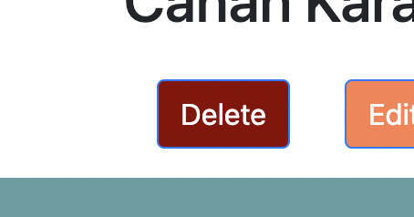

<h1 align="center"> Lab Report Management System </h1>  

<!-- START doctoc generated TOC please keep comment here to allow auto update -->
<!-- DON'T EDIT THIS SECTION, INSTEAD RE-RUN doctoc TO UPDATE -->
## Table of Contents

- [Introduction](#introduction)
- [Features](#features)
- [System Requirements](#system-requirements)
- [Build Process](#build-process)
- [Technologies](#technologies)

<!-- END doctoc generated TOC please keep comment here to allow auto update -->

 

## Introduction

Lab Report Management System is a system which managers and laborants can add ,view ,edit ,delete reports and manage a report process easily. This system runs on web.

 

## Features

A few of the things users can do with Lab Report Management System:

* Login With User ID and Password

    

* View All Reports

    

* Add New Report

    

* View A Report

    

* Update A Report

    

* Delete A Report

    

* Search Reports via Patient Name , Laborant Name , Patient TC

    
    
    

* Sort Reports by Date

    

    

* Attach A Image to Reports

    

* View All System Users (Managers can perform only)

    

* Add New System User (Managers can perform only)

    

* View A System User (Managers can perform only)

    

* Update A System User (Managers can perform only)

    

* Delete A System User (Managers can perform only)

    

## System Requirements

- Java 8 (or higher)
- Maven 3.x.x (or higher)
- PostgreSQL 14 (or higher)

## Build Process

- Create a PostgreSQL server

 

- Clone or download the repo

 

- Configure src/main/resource/application.properties
  * `spring.datasource.url = YOUR URL`
  * `spring.datasource.username = YOUR USERNAME`
  * `spring.datasource.password = YOUR PASSWORD`
  
 

- Run the following command in a terminal window (in the complete) directory:
  * `./mvnw spring-boot:run`

 

- Open system
  * For local usage : `localhost:8080`
  
 

- For initial login admin login informations :
  * `username : 1000000`
  * `password : admin`

## Technologies

- Java
- Spring
- Thymeleaf
- Hibernate
- Maven
- PostgreSQL
- Javascript
- Boostrap
- HTML / CSS

