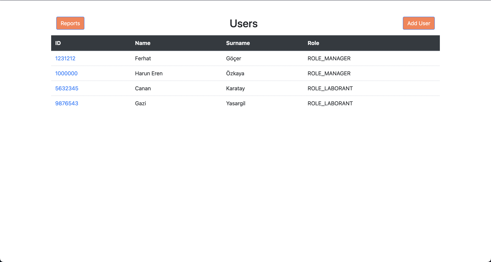

<h1 align="center"> Lab Report Management System </h1>  

<!-- START doctoc generated TOC please keep comment here to allow auto update -->
<!-- DON'T EDIT THIS SECTION, INSTEAD RE-RUN doctoc TO UPDATE -->
## Table of Contents

- [Introduction](#introduction)
- [Features](#features)
- [System Requirements](#system-requirements)
- [Build Process](#build-process)
- [Technologies](#technologies)

<!-- END doctoc generated TOC please keep comment here to allow auto update -->

 

## Introduction

Lab Report Management System is a system which managers and laborants can add ,view ,edit ,delete reports and manage a report process easily. This system runs on web.

 

## Features

A few of the things users can do with Lab Report Management System:

* Login With User ID and Password

    

* View All Reports

    

* Add New Report

    

* View A Report

    

* Update A Report

    

* Delete A Report

    

* Search Reports via Patient Name , Laborant Name , Patient TC

    
    
    

* Sort Reports by Date

    

    

* Attach A Image to Reports

    

* View All System Users (Managers can perform only)

    

* Add New System User (Managers can perform only)

    

* View A System User (Managers can perform only)

    

* Update A System User (Managers can perform only)

    

* Delete A System User (Managers can perform only)

    

## System Requirements

- Java 8 (or higher)
- Maven 3.x.x (or higher)
- PostgreSQL 14 (or higher)

## Build Process

<!--
- Follow the [React Native Guide](https://facebook.github.io/react-native/docs/getting-started.html) for getting started building a project with native code. **A Mac is required if you wish to develop for iOS.**
- Clone or download the repo
- `yarn` to install dependencies
- `yarn run link` to link react-native dependencies
- `yarn start:ios` to start the packager and run the app in the iOS simulator (`yarn start:ios:logger` will boot the application with [redux-logger](<https://github.com/evgenyrodionov/redux-logger>))
- `yarn start:android` to start the packager and run the app in the the Android device/emulator (`yarn start:android:logger` will boot the application with [redux-logger](https://github.com/evgenyrodionov/redux-logger))

Please take a look at the [contributing guidelines](./CONTRIBUTING.md) for a detailed process on how to build your application as well as troubleshooting information.

**Development Keys**: The `CLIENT_ID` and `CLIENT_SECRET` in `api/index.js` are for development purposes and do not represent the actual application keys. Feel free to use them or use a new set of keys by creating an [OAuth application](https://github.com/settings/applications/new) of your own. Set the "Authorization callback URL" to `gitpoint://welcome`.

-->

## Technologies

- Java
- Spring
- Thymeleaf
- Hibernate
- Maven
- PostgreSQL
- Javascript
- HTML / CSS

